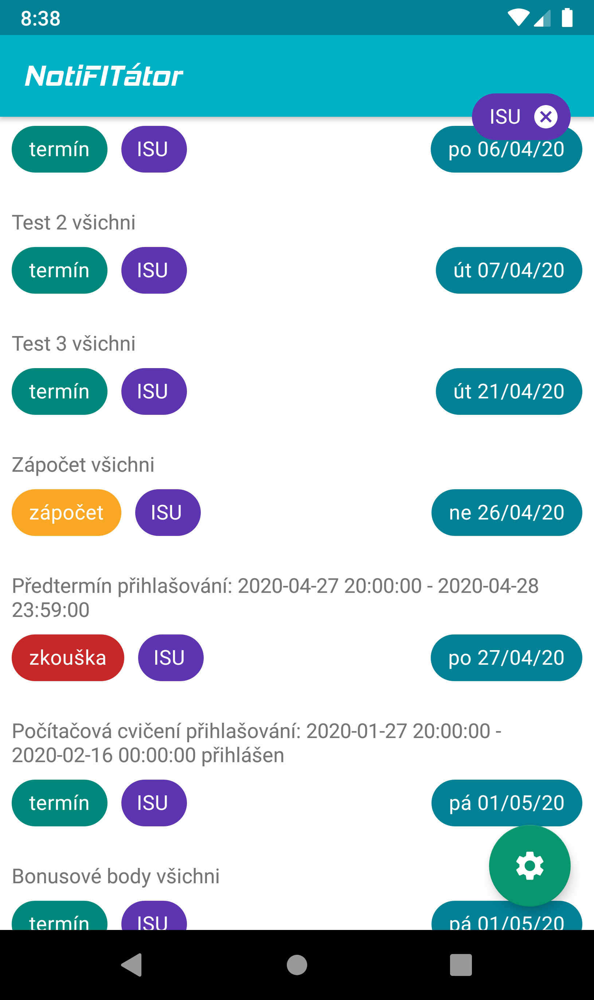
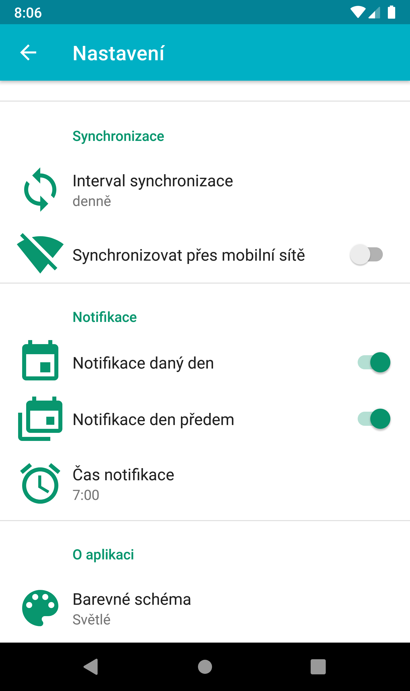

#  NotiFITátor

## ...a už nikdy neodevzdáte projekt pozdě!

Android aplikace pro notifikace z informačního systému WIS Fakulty informačních technologií ([FIT](https://www.fit.vut.cz/)) VUT v Brně.

V bodech:

- Licencováno pod GPLv3

- Aplikace je dostupná v češtině a angličtině

- Čistý design s použitím minima knihoven

- Čas notifikace lze nastavit, stejně jako upozornění den dopředu

- Automatická synchronizace s [WIS](https://wis.fit.vutbr.cz)em - s nastavitelnou periodou a možností zakázat přes mobilní data

- Heslo je uloženo zašifrované, nelze se k němu dostat ani s rootem

- Každému předmětu je přiřazena pro přehlednost barva. Kliknutím na předmět, nebo typ termínu, lze vyfiltrovat pouze daný předmět, respektive typ

- Od tvůrce neoficiální aplikace systému "iŠkola" pro Android - [iŠkola kilent](http://ss11mik.webz.cz/projects/iSkola), která má asi 150 uživatelů napříč ČR

## Screenshoty

